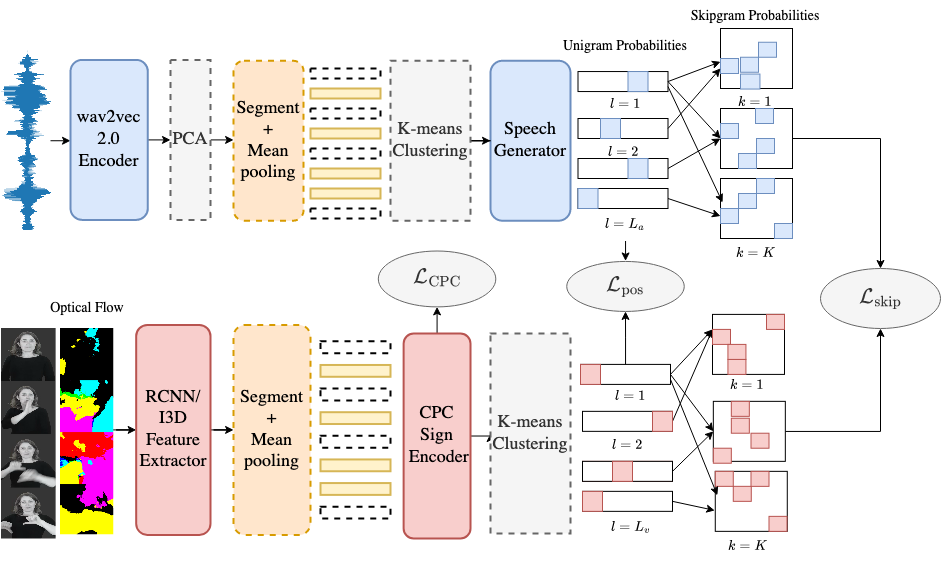

# Unsupervised Speech-to-Sign Language Recognition
<div align="middle"></div>
This repository contains the source code for the paper "Listen, Decipher and Sign: Toward Unsupervised Speech-to-Sign Language Recognition (https://www.researchgate.net/publication/370832215_Speak_Decipher_and_Sign_Toward_Unsupervised_Speech-to-Sign_Language_Recognition).

### Dependencies
- [fairseq](https://github.com/pytorch/fairseq) >= 1.0.0 with dependencies for [wav2vec-u](https://github.com/pytorch/fairseq/tree/main/examples/wav2vec/unsupervised)
- [CPC_audio](https://github.com/facebookresearch/CPC_audio.git) >= b98a1bdf1fe9ea219816db7a6c28115d404a3510
- [pytorch-i3d](https://github.com/piergiaj/pytorch-i3d.git) >= 05783d11f9632b25fe3d50395a9c9bb51f848d6d
- [python-dtw](https://pypi.org/project/dtw-python)

### How to run it?
0. Change paths marked by ```<=====``` in ```run_{asl_librispeech, ljspeech}.sh```

1. Download [LibriSpeech](https://www.openslr.org/12) and its [forced alignment](https://github.com/CorentinJ/librispeech-alignments.git) and [LJSpeech](https://keithito.com/LJ-Speech-Dataset) (for character speech2sign-U only); download [Unvoiced](https://github.com/grassknoted/Unvoiced) and [MS-ASL](https://www.microsoft.com/en-us/research/project/ms-asl)

2. Copy customized codes to off-the-shelf packages:
```
cp -r cpc ../CPC_Audio
cp -r pytorch-i3d/* ../pytorch-i3d
```

3. Character-level speech2sign-U:
```
bash run_ljspeech.sh
```

4. Word-level speech2sign-U:
```
bash run_asl_librispeech.sh
```

The repository is currently under construction. More details soon!
